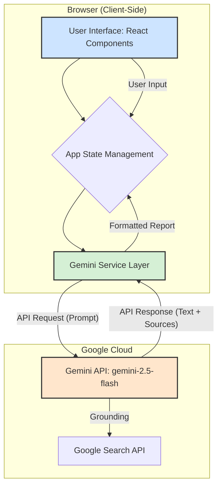

# Application Architecture

This document outlines the high-level architecture of the AI Sales Prospecting Agent. The application is a client-side single-page application (SPA) that interacts directly with the Google Gemini API.

## Architecture Diagram (Mermaid)

## Component Breakdown

### 1. User Interface (React Components)
-   **Location**: `src/components/`
-   **Description**: This layer consists of all the visual elements the user interacts with.
    -   `ProspectingForm.tsx`: A controlled form for capturing the user's prospecting query (company/industry, focus area, etc.).
    -   `ProspectResult.tsx`: Displays the generated report from the AI, including formatted text and source links. It also handles the PDF download logic.
    -   `LoadingSpinner.tsx`: Provides visual feedback to the user while the API call is in progress.
    -   `LinkList.tsx`: Renders the list of web sources provided by the Gemini API's grounding feature.

### 2. App State Management (`App.tsx`)
-   **Location**: `src/App.tsx`
-   **Description**: This is the main component that orchestrates the application. It holds the central state, including `isLoading`, `error`, and the `prospectReport` data. It passes down state and callback functions (like `handleProspectingSubmit`) to its child components.

### 3. Gemini Service Layer (`geminiService.ts`)
-   **Location**: `src/services/geminiService.ts`
-   **Description**: This module abstracts all communication with the Gemini API. Its primary responsibility is to:
    -   Construct a detailed, engineered prompt based on user input.
    -   Initialize the `@google/genai` client.
    -   Make the `generateContent` API call, enabling the Google Search tool for grounding.
    -   Parse the API response, separating the text content from the grounding metadata (source links).
    -   Handle API errors gracefully.

### 4. Gemini API (External Service)
-   **Description**: This is the backend AI service provided by Google.
    -   **`gemini-2.5-flash` Model**: The specific model used for its balance of speed and capability in text generation.
    -   **Google Search Grounding**: The API is configured to use Google Search to find up-to-date information related to the prompt, making the generated report more accurate and timely. The search results' URLs are returned alongside the generated text.
