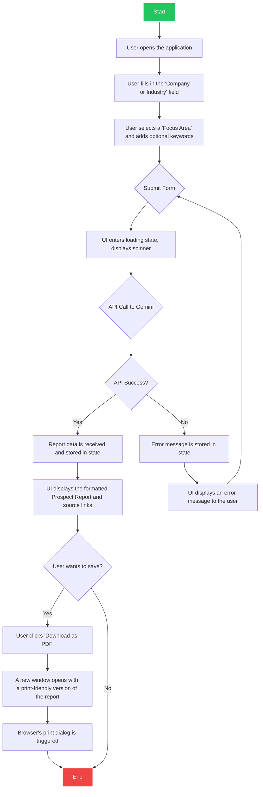

# User & Data Flow

This document describes the typical flow of events from the user's perspective and how data moves through the application.

## User Flow Diagram (Mermaid)

## Flow Explanation

1.  **Initialization**: The user lands on the page and is presented with the `ProspectingForm`.
2.  **Input**: The user provides the necessary information for the prospecting query:
    -   A target company or industry (e.g., "Nike" or "Footwear Retailers").
    -   A specific focus area from a dropdown list (e.g., "Supply Chain Challenges").
    -   Optional additional context or keywords.
3.  **Submission**: The user clicks the "Generate Prospect Report" button. This action triggers the `handleProspectingSubmit` function in `App.tsx`.
4.  **Loading State**: The application's state is immediately updated to `isLoading = true`. The form fields become disabled, and the `LoadingSpinner` component is rendered to provide feedback that the request is being processed.
5.  **API Request**: The `geminiService` constructs a detailed prompt using the user's input and sends it to the Gemini API. The request specifies that Google Search should be used for grounding.
6.  **API Response**: The Gemini API processes the request, performs web searches for relevant, up-to-date information, generates the report, and sends back a response containing:
    -   The generated text in Markdown format.
    -   A list of source URLs (`groundingChunks`).
7.  **State Update & Rendering**:
    -   **On Success**: The `isLoading` state is set to `false`, and the received report data is stored in the `prospectReport` state variable. The `ProspectResult` component then renders this data, displaying the report and the source links.
    -   **On Failure**: The `isLoading` state is set to `false`, and the error message is stored in the `error` state variable. The UI then displays this error message to the user.
8.  **PDF Export (Optional)**: If the user clicks the "Download as PDF" button, the `handleDownloadPdf` function in `ProspectResult` is called. It generates a new HTML document in a separate browser window, applies print-specific CSS, and invokes the browser's print functionality, allowing the user to save the document as a PDF.
