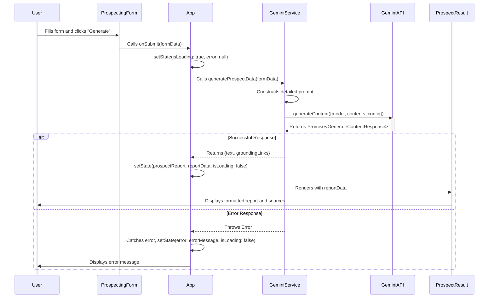

# Sequence Diagram

This diagram illustrates the sequence of interactions between the user, the application components, and the Gemini API when a prospect report is generated.

## Mermaid Sequence Diagram

## Sequence Explanation

1.  **User Interaction**: The sequence begins when the user fills out the `ProspectingForm` and clicks the submit button.
2.  **Form Submission**: The `ProspectingForm` component invokes the `onSubmit` callback function, passing the form data up to the parent `App` component.
3.  **State Change (Loading)**: The `App` component sets its state to reflect that a process is underway (`isLoading: true`). This triggers a re-render to show the loading spinner.
4.  **Service Call**: `App` calls the `generateProspectData` function from the `GeminiService`, passing along the user's input.
5.  **API Request**:
    -   The `GeminiService` takes the input and builds a carefully structured prompt.
    -   It then makes an asynchronous call to the `GeminiAPI`'s `generateContent` endpoint.
6.  **API Processing**: The `GeminiAPI` processes the request, including performing any necessary Google Searches for grounding, and eventually resolves the promise with a `GenerateContentResponse` object.
7.  **Handling the Response**:
    -   **Success Path**:
        -   The `GeminiService` receives the response, extracts the `text` and `groundingLinks`, and returns this structured data to the `App` component.
        -   `App` updates its state with the new report data and sets `isLoading` to `false`.
        -   This state change causes the `ProspectResult` component to render on the screen, displaying the report to the `User`.
    -   **Error Path**:
        -   If the API call fails or the `GeminiService` encounters an error, it throws an exception.
        -   The `App` component's `try...catch` block catches this error.
        -   `App` updates its state with the error message and sets `isLoading` to `false`.
        -   The UI re-renders to display the error message to the `User`.
